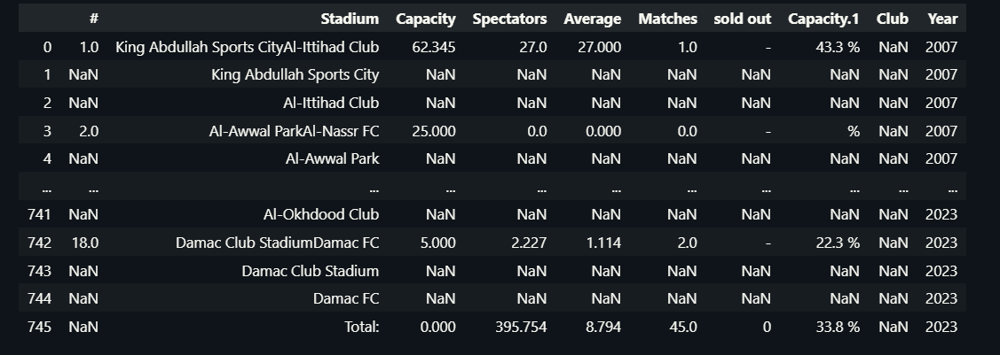
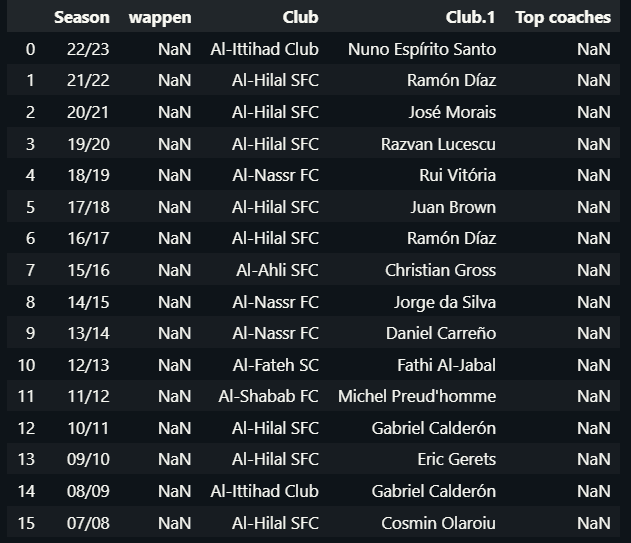
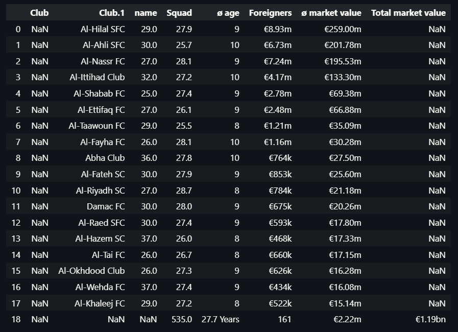
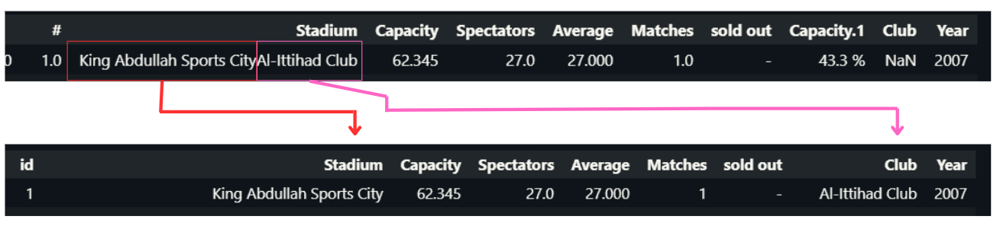
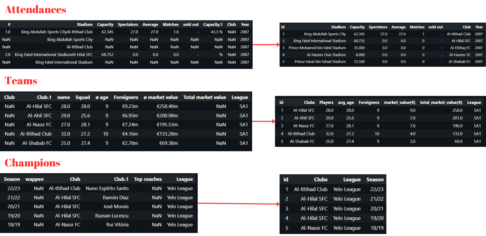
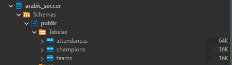
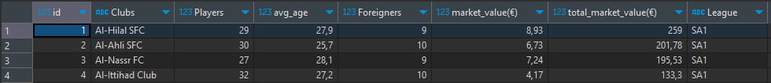
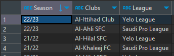
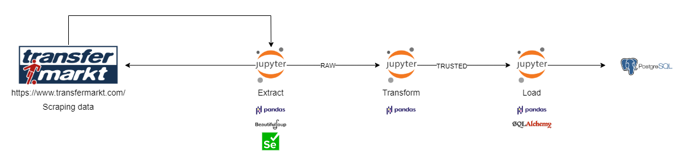

# Saudi Pro League - Attendances, Clubs Info, Champions   Scraping Transfermarket

The Saudi Pro League (SPL), is the highest division of association football in the Saudi Arabia.

In the last few years of the SPL, it has been linked to transfers and million-dollar contracts, and more recently big European football stars packed their bags and went to Saudi Arabia, bringing greater exposure to the League.

I decided to extract this data in order to enable analysis of the league.

Saudi Pro League - [Wikipedia](https://en.wikipedia.org/wiki/Saudi_Pro_League)

#### Libraries used:
  - Pandas:
      - for data manipulation and analysis.
  - Selenium:
      - for automating web browser tasks, with Selenium, I can have the ideal scenario for dynamic web pages.
  - SQLAlchemy:
      - for database interaction, choose this lib due to its practicality.
  - BeautifulSoup:
      - for parsing and navigating HTML.

#### Extract

When it comes to gathering data from [Transfermarket](https://www.transfermarkt.com), I rely on Selenium, BeautifulSoup, Pandas, and re. To complete this project, I opted for the Google Chrome driver.

Within the extract notebook, there are three separate areas for scraping different URLs. These areas include:
  1. Extracting attendances data from the 2007-2023 season.
  2. Gathering information on 1st and 2st Division teams.
  3. Extracting data on all 1st and 2st Division champions.

I use Pandas to preprocess data, transform it into CSV format and then store it in the RAW zone.

[Extract - Notebook](https://github.com/MatheusSanteago/ScrapingSPLAttendances/blob/master/extract.ipynb)

##### Results

Attendances - RAW 
 

Champions - RAW 
 

Teams - RAW 
 

#### Transform

In this step I performed the necessary transformations to improve the quality of the DataFrames. I used Pandas to manipulate the DataFrames, and re to make corrections with regex. 

Nootebok has three functions that perform different transformations according to the content coming from the RAW DataFrame.

After each transformation, the Trusted layer is loaded, where the data is already processed.

In this transformation, I highlight the use of regex to make changes to the Stadium and Clubs columns, where both information can be extracted from a single line.

Arab teams have a similar name pattern, by identifying this I was able to create a pattern where I could extract the data.
##### Pattern 
    pattern = "\B[ANH][Llab][-]?[a-zA-Z]+(?:-[a-zA-Z]+)?\s?[SFClub]{1,4}"
###### Example
Where it is pink, I used the pattern with the findall() method from the re library. Where it extracts a list of words according to the pattern

In red, I used the sub() method, in this case where it was identified the pattern was replaced by the empty string. Resulting only in the name of the stadium.

  ###### Code fragment
     df.iloc[i, 6] = re.findall(pattern=pattern, string=df.iloc[i, 0])[0]
     
     df.iloc[i, 0] = re.sub(pattern=pattern, string=df.iloc[i, 0], repl="")
  
  My regex pattern didn't work for all clubs, so I solved it using an IF/ELIF, while I don't create a better pattern.
  
  ###### Code fragment
  
    for i in range(len(df)):
        if "Al-Ansar" in df.iloc[i, 0]:
            ...
        elif "Ohod Club" in df.iloc[i, 0]:
            ...
        elif "Damac FC" in df.iloc[i, 0]:
            ...
        else:
            ...

##### Results 

[Transform - Notebook](https://github.com/MatheusSanteago/ScrapingSPLAttendances/blob/master/transform.ipynb)

#### Load

To load the data saved in the Trusted layer, I used SQLalchemy due to the practicality of using the create_engine() method in conjunction with the pandas to_sql() method.

I didn't have any major difficulties here, I just opened the CSV files from Trusted Zone, connected them to PostgreSQL, and finished using to_sql for each Dataframe, creating the Attendances, Teams, and Champions tables

###### Results

##### Database - arabic_soccer

[Load - Notebook](https://github.com/MatheusSanteago/ScrapingSPLAttendances/blob/master/transform.ipynb)

#### Data Flow

